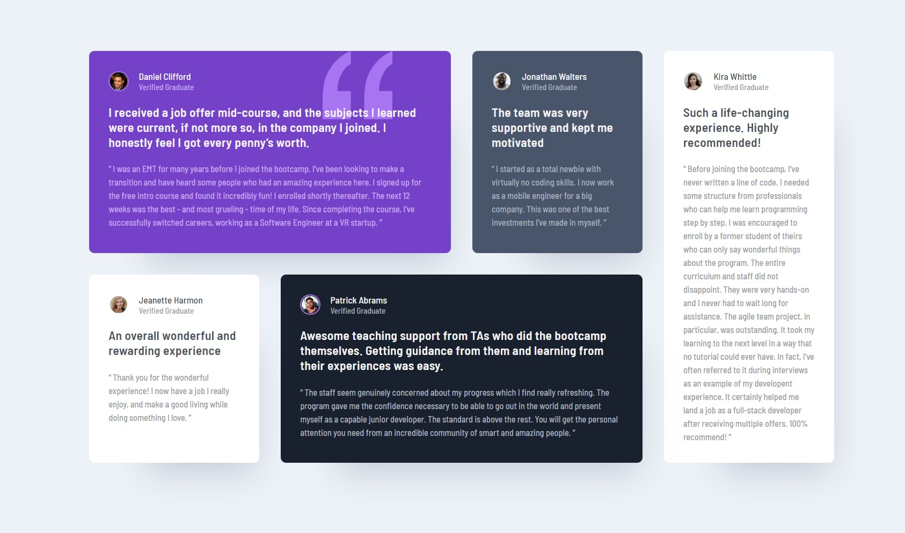

# Frontend Mentor - Testimonials grid section solution

This is a solution to the [Testimonials grid section challenge on Frontend Mentor](https://www.frontendmentor.io/challenges/testimonials-grid-section-Nnw6J7Un7). Frontend Mentor challenges help you improve your coding skills by building realistic projects.

## Table of contents

- [Overview](#overview)
  - [The challenge](#the-challenge)
  - [Screenshot](#screenshot)
  - [Links](#links)
- [My process](#my-process)
  - [Built with](#built-with)
  - [What I learned](#what-i-learned)
  - [Useful resources](#useful-resources)
- [Author](#author)

## Overview

### The challenge

Users should be able to:

- View the optimal layout for the site depending on their device's screen size

### Screenshot

### Links

- Solution URL: [Add solution URL here](https://www.frontendmentor.io/solutions/testimonials-solution-using-css-grid-wGa5Mwn8B)
- Live Site URL: [Add live site URL here](https://flxemt.github.io/testimonials-grid-section)

## My process

### Built with

- Semantic HTML5 markup
- CSS custom properties
- Flexbox
- CSS Grid

### What I learned

Building responsive cards layout with CSS Grid

### Useful resources

- [CSS Tricks Grid tutorial](https://css-tricks.com/snippets/css/complete-guide-grid/) - A nice CSS Grid guide.
- [Scrimba CSS Grid course](https://scrimba.com/learn/cssgrid) - This is an amazing interactive CSS Grid course from Scrimba.

## Author

- Frontend Mentor - [@flxemt](https://www.frontendmentor.io/profile/flxemt)
- Twitter - [@flxemt](https://twitter.com/flxemt)
